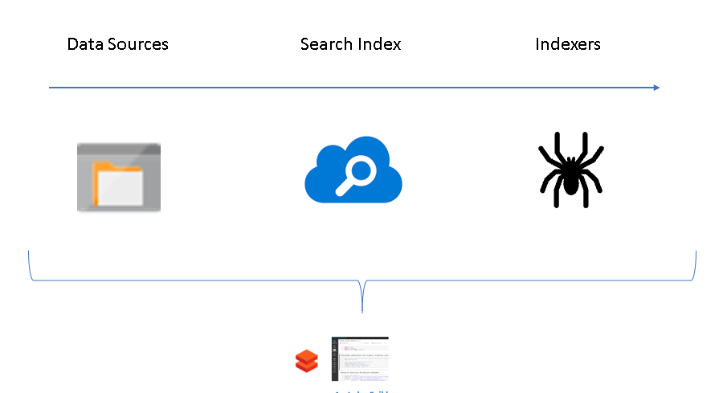

# Entity Match with Proximity-boosting Using Azure Search And Azure Databricks

This set of Databricks notebooks will allow you to create an Azure Search Index, load master data and match entities from an external source in batch mode. In order to conduct the search a RESTful API is invoked using a Python User Defined Function (UDF) The process could be adapted to streaming mode by modifying the UDF and read operations to readstream. The matching notebook includes a threshold parameter (Widget) which can be used to define the cut-off score for which anything result below that score is considered a false-positive.

The search functionality is rich with the following options:
- geo-proximity boosting. If GeoJson 
- fuzzy matching
- Edit Distance, Jaro Winkler, length ratio scoring anhancements
- Stop word demotion (reduces affect on score)

Please import the archive of notebooks into your Azure Databricks workspace to get started. Additional information can also be found below.

================================================================================

Benefits of Azure Search
========================

-   Fully managed PaaS service -- lowest cost of ownership

-   Process could be fully scripted end-to-end (CI/CD pipeline)

    -   Create Search service (ARM), create index, data source indexer via API or SDK

-   Pricing & usage: usage is billed per hour

    -   Can terminate service when not required to reduce cost

-   Scale: ability to scale (online) up and down during peak processing

-   Ability to incorporate Cognitive Services using skillsets

-   Geospatial support & Scoring Profiles

-   Simplified implementation & reduce query complexity

Data Ingestion
==============

-   Geospatial data

    -   Ensure data is in GeoJSON format.

    -   Eg: \"location\":{\"type\": \"Point\", \"coordinates\": \[49.5328469,8.7268988\]}

-   Improving ingestion time:

    -   Consider multiple indexers. 50 indexers can be spawned on the standard tier

    -   Partitioning of flat folder structure into **n** number of folders with **n** indexers

    -   Increasing partitions = increases costs but can provide better ingestion rates and reduced query time

    -   Increase replicas will not improve ingestion. Used for increased query throughput (requests per second) due to additional compute & load balancing

    -   Further reading:

https://docs.microsoft.com/en-gb/azure/search/search-limits-quotas-capacity

https://docs.microsoft.com/en-us/azure/search/search-performance-optimization

Azure Search Ingestion Options
==============================

Index creation and loading using REST APIs
==========================================

================================================================================

Parallel loading operation using indexers
=========================================

Geo-spatial Queries
===================

-   Requires the Edm.GeographyPoint data type

-   Filtering:

    1.  Geo.distance returns the distance in kilometers between two points

    2.  Geo.intersects returns true if a given point is within a given polygon

    3.  Distance boosting increases the score (rank) when closer to geo point

[Geo.distance filtering]{.underline}

Compared to

[Proximity boosting using Scoring Profile]{.underline}

AWS ES to Azure Search Challenges
=================================

-   Handling of geospatial data

    -   Elastic Search: Supports [5 different](https://www.elastic.co/guide/en/elasticsearch/reference/current/geo-point.html) geo-point formats including geo-point expressed as object

    -   Azure Search:

        -   Loading only supports [GeoJSON Point](https://docs.microsoft.com/en-gb/rest/api/searchservice/Supported-data-types) format (Lon, Lat)

        -   Queries only support [Well-known Text (WKT)](https://docs.microsoft.com/en-us/azure/search/search-query-odata-geo-spatial-functions) point

POINT(lon lat): geo.distance(\[FIELD\_NAME\],geography\'POINT(\"\[LON\] \[LAT\]\")\') le 1

-   No ability to port existing Lucene queries

-   Analyzers: Only one analyzer can be applied to a field at a time

    -   Eg: stopwords and German language analyzer could not be applied simultaneously

-   Kibana (self service analytics UI) vs "Search App" (preview) for standard search UI -- no analytics
